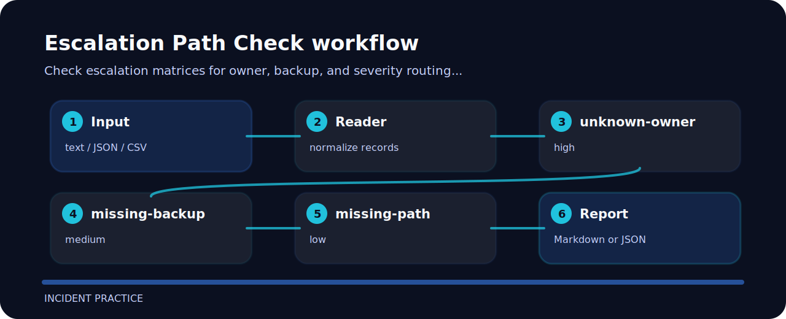

# Escalation Path Check


Check escalation matrices for owner, backup, and severity routing gaps. It keeps the review small: one input file, a short list of findings, and enough context to fix the line that caused the warning.

## Signals

| Signal | Level | What it flags | Fix direction |
| --- | --- | --- | --- |
| `unknown-owner` | high | owner is missing | assign primary owner |
| `missing-backup` | medium | backup is missing | assign backup path |
| `missing-path` | low | escalation path missing | document page or contact route |

## Input contrast

```text
risky: severity p0 owner unknown backup none path missing
clean: severity p0 owner platform backup sre-manager path pager
```

## Try the fixture

```bash
git clone https://github.com/mertefekurt/escalation-path-check.git
cd escalation-path-check
python -m pip install -e ".[dev]"
escalation-path-check examples/sample.txt
```

## Signal route


